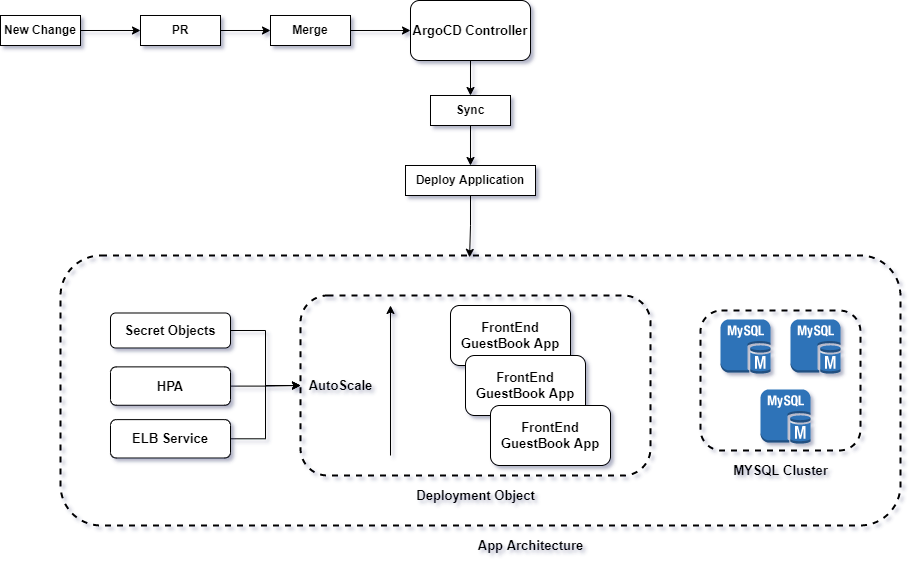
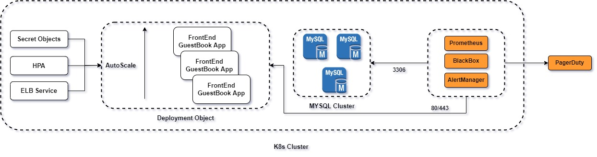
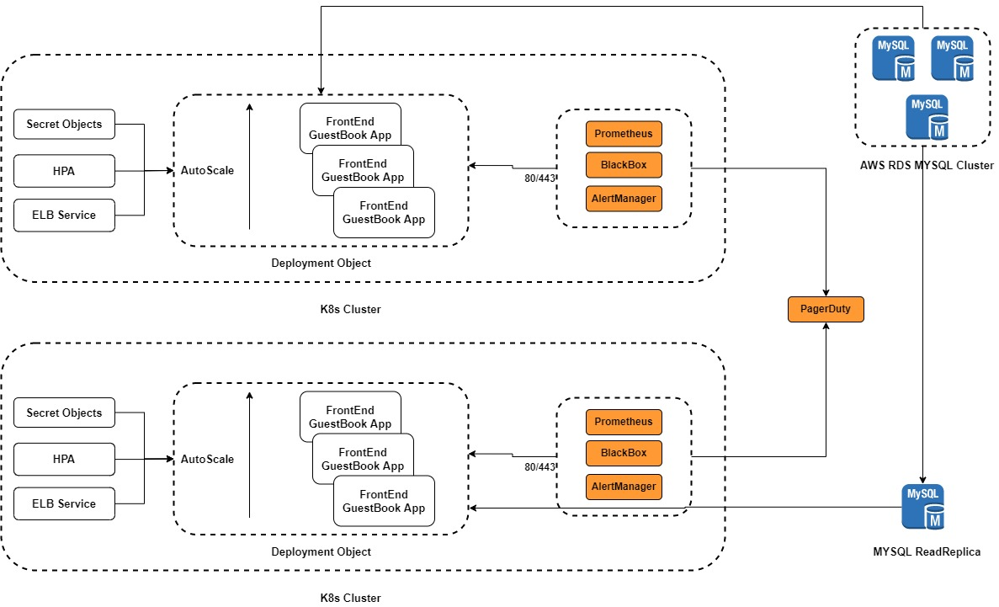

# Assessment Details

## Cluster creation

For simple cluster creation process I'm using eksctl, the same could be done using Terraform module for enterprise cluster management.

```YAML
apiVersion: eksctl.io/v1alpha5
kind: ClusterConfig

metadata:
    name: spinnakerdemo
    region: ca-central-1

iam:
  withOIDC: true

vpc:
  cidr: 10.10.0.0/16
  autoAllocateIPv6: false
  clusterEndpoints:
    publicAccess: true
    privateAccess: false

addons:
  csi:
    enableVolumeScheduling: true
    enableVolumeResizing: true
    enableVolumeSnapshot: true
    enableVolumeSnapshotClass: true
    ebs:
      enable: true

nodeGroups:
    - name: ng-1
      minSize: 1
      maxSize: 2
      instancesDistribution:
        instanceTypes: ["m5a.large", "m5.large"]
        onDemandBaseCapacity: 0
        onDemandPercentageAboveBaseCapacity: 0
        spotInstancePools: 2
```

> Note: 
> - Since certain tools need extra implementation i.e **HashiCorp Vault**, I'm storing all the creds are stored in github withing K8s secret object (base64). But the same will be stored in HashiCorp vault for enterprise setup.

## Application Architecture and Flow



## Install ArgoCD

> Note: The argocd installation manifest file under argocd folder is customized to support multiple namespace in same cluster.

```
kubectl apply -f argocd/main.yml
```

## MySQL Operation Installation

> Ref: https://github.com/mysql/mysql-operator

```
helm repo add mysql-operator https://mysql.github.io/mysql-operator/

helm install mysql-operator mysql-operator/mysql-operator --namespace mysql-operator --create-namespace

helm install mysqlcluster mysql-operator/mysql-innodbcluster \
        --namespace default \
        --set credentials.root.user='root' \
        --set credentials.root.password='root-pass' \
        --set credentials.root.host='%' \
        --set serverInstances=3 \
        --set routerInstances=1 \
        --set tls.useSelfSigned=true
```

## Application Deployment

> **Ref:** https://github.com/ruanbekker/flask-mysql-guestbook

> **Note:** In this setup ArgoCD does not have HashiCorp vault plugin installed, Assumed that it will be available in Production setup.

From github one of the opensource application has been taken and modified few areas for this assessment.

### To Install App Via ArgoCD and handle further changes.

- Commit the manifest file in `guestbook/main.yml` to the git repository.
- Create a application in Argo CD and provide the github details, If it;s a private repo then add the creds to the argocd platform.
- Enable auto sync to allow argo to perform gitops.
- To upgrade to new release, use the CI pipline to build the new image.
- Update the image name in the guestbook-argocd/main.yml file.

## Monitoring Setup

For Monitoring the application promtheus operator will be used with three components:

- Node Exporter
- MySQL Exporter
- BlackBox probing



For log monitoring, We can use splunk or ELK.

**Important metrics:**

**[Application]**

- Response time
- Uptime
- CPU/Memory Usage

**[MySQL]**

- Uptime
- CPU/Memory Usage
- Storage
- IO Mertrics
- Replication Delay
- CLuster health

**Important Log metrics:**

- Exception ratio for past 5 mins.
- Specific keywors like failure, traceback, will be watched and triggered if any anomilies are seen.
- LoadBalancer 5xx error ratio.
- LoadBalancer 401 error ratio.

## Disaster Recovery setup



- To achieve the DR for this application, I'm proposing to have multi region cluster and Database hosted in AWS RDS cluster and using read replica across the Secondary region.
- During the DR activity, the Read Replica can be promoted to a Writer and it can be connected to the application server.
- The ingress/Loadbalancer CNAME can be swapped during the DR.
- The argoCD can take care of the deployment in the both the regions with seperate Repo for each i.e. primary app repo and secondary to distinguish between the config and secrets.
- If we are using hashicorp vault here, the vault should also support DR implementation.